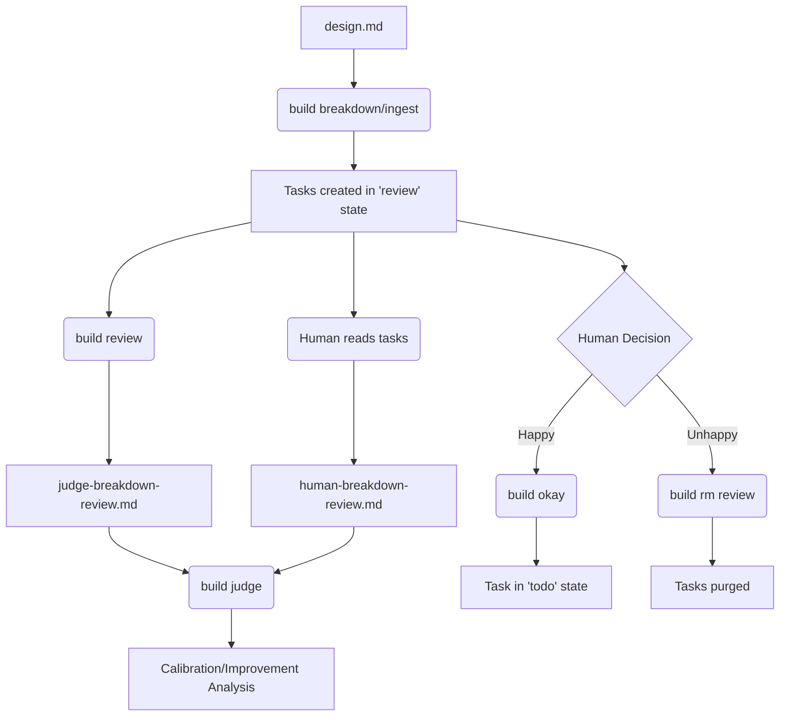

# Breakdown Quality Measurement & Review System

## 1. User Story
- **Headline**: Implement a human-in-the-loop staging and evaluation system for task ingestion.
- **Problem Statement**: When `design.md` files are passed through the `breakdown` engine and ingested, there is potential for "translation drift" (omission of requirements, addition of hallucinations, or poor execution granularity). If bad tasks enter the system, it leads to garbage-in-garbage-out. There is currently no way to safely stage, review, or evaluate the quality of the breakdown against the original design.
- **Objective**: 
  1. Change default ingest behavior to place tasks in a new `review` status.
  2. Build CLI tools to manage tasks in bulk or individually based on status.
  3. Build an evaluation pipeline where an LLM judge and a Human can independently audit the breakdown, and a "Referee" compares them to generate prompt-improvement feedback.
- **Expected Outcome**: A developer can confidently run `build ingest`, review the staged tasks, run an automated/human evaluation loop to improve the system's accuracy, and quickly promote (`build okay`) or purge (`build rm`) tasks based on the review.

## 2. Implementation Backlog

### ## Pending

- **[STATE]** Update task state machine / schemas to support the `review` status.
- **[INGEST]** Modify `build ingest` (or related `breakdown` pipeline) to set default task status to `review` instead of `todo`.
- **[CLI]** Implement `build rm <status>` subcommand to bulk-delete tasks matching a specific status (e.g., `build rm review` or `build rm done`).
- **[CLI]** Implement `build status <task ID> <status>` subcommand to explicitly transition a task's state. Must include error handling for non-existent IDs.
- **[CLI]** Implement `build okay <task ID>` as an alias/shortcut to move a task specifically from `review` to `todo`. Must fail if the task is not currently in `review`.
- **[CLI]** Implement `build review`: 
  - Reads `design.md` and the newly ingested `review` tasks.
  - Extracts baseline facts and evaluates them via Boolean checking (Omission/Addition/Execution drift).
  - Outputs findings to `judge-breakdown-review.md`.
- **[CLI]** Implement `build judge <llm_file> <human_file>`:
  - Takes the LLM's review and the human's manual review.
  - Analyzes the deltas (where was the human right, where was the LLM right).
  - Outputs a comparison report to guide prompt engineering.

### ## Current
*(None - Ready for Agent)*

### ## Completed
*(None)*

## 3. Architecture Overview

### File Tree Context
Changes will primarily affect the CLI layer (`cmd/`) and the core task management/storage layer. 
```text
cmd/
  rm.go       (New: bulk delete by status)
  status.go   (New: update specific task state)
  okay.go     (New: shortcut for review -> todo)
  review.go   (New: trigger LLM judge)
  judge.go    (New: LLM vs Human comparison)
internal/
  tasks/      (Update: add 'review' state, update ingest defaults)
```

### Flow Diagram


## 4. Checklist & TDD Requirements

- **Legend & Labels**: 
  - `[STATE]` - Core entity/schema modifications
  - `[CLI]` - Command line interface and parsing
  - `[TEST-UNIT]` - Core logic testing
  - `[LLM]` - AI prompt execution logic

- **Dependency Ordering**:
  1. `[STATE]` Add `review` status to core enums/types.
  2. `[TEST-UNIT]` Prove state transitions and validation rules work.
  3. `[INGEST]` Update default ingest behavior.
  4. `[CLI]` Build `rm`, `status`, and `okay` commands (testing against the new state).
  5. `[LLM]` Build the `build review` extraction/fact-checking script.
  6. `[LLM]` Build the `build judge` comparison script.

- **TDD Enforcement**: 
  - Every CLI command must have a failing test before implementation.
  - `build okay` must have a specific unit test proving it rejects tasks *not* in `review`.
  - `build rm` must have a specific test proving it only deletes the targeted status.

## 5. Agent Instructions for Implementation
- Read-Analyze-Explain-Propose-HALT!
- Only edit one file at a time.
- Do not edit a file without a test.
- Prove tests pass before moving to the next file.
- If an LLM prompt for `build review` or `build judge` needs tweaking, document the prompt strategy in a comment before coding.
