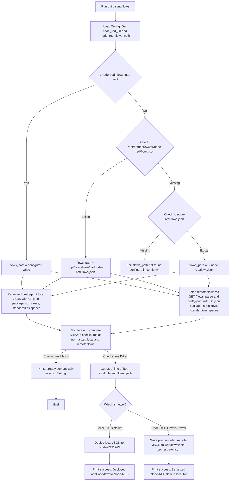

# Design: Bidirectional Node-RED Workflow Synchronization

## User Story
* **Headline**: Sync workflows between local Git files and live Node-RED with infinite-loop prevention and semantic JSON normalization
* **Problem Statement**: Developers have different preferences for editing workflows: some prefer writing/editing JSON files directly in their IDE and committing to Git, while others prefer the visual, interactive Node-RED UI. Currently, there is no way to automatically keep the local JSON files in `workflows/` and the live Node-RED server in sync without manual export/import. Furthermore:
  - Bidirectional sync using purely file modification times would trigger an infinite syncing loop, as writing to one file updates its timestamp and triggers a reverse sync on the next run.
  - Comparing raw JSON files or string responses using hashes is susceptible to formatting, minification, and key-ordering discrepancies, causing false-positive sync triggers for logically identical flows.
* **Objective**: Create an automated, bidirectional syncing command (`build sync-flows`) that:
  - Parses both the local file and remote GET `/flows` API response into generic Go objects (`[]map[string]interface{}`).
  - Re-serializes both objects deterministically (Go's standard `json` library automatically sorts all map keys alphabetically) using consistent pretty-printing (4-space indentation).
  - Calculates the SHA256 checksums of these **normalized** byte slices.
  - If the normalized checksums match, it short-circuits and exits immediately (proving they are already semantically in sync and preventing infinite loops).
  - If they differ, it compares the modification time of `workflows/sdlc-orchestrator.json` with the active Node-RED flows file to see which was edited more recently, and propagates the changes so the newer version "wins" and stays synchronized.
* **Expected Outcome**: 
  - If the normalized checksums are identical: Exit immediately with no actions.
  - If different and local file is newer: Deploy it to Node-RED.
  - If different and Node-RED flow is newer: Fetch the active flows from the Node-RED API, format them with deterministic sorted keys and 4-space indentation, and serialize them back into `workflows/sdlc-orchestrator.json`.

---

## Implementation Backlog

### Pending
- Task 1: Update the configuration engine (`internal/config/config.go`) to support an optional `node_red_flows_path` configuration, defaulting to standard locations if omitted.
- Task 2: Implement the semantic JSON normalization and SHA256 comparison engine under `internal/syncflow`.
- Task 3: Implement the `sync-flows` subcommand in Go, comparing normalized content SHA256 hashes first (to prevent loops), and then comparing file modification times to perform the bidirectional sync.
- Task 4: Add comprehensive unit and integration tests to verify both sync directions, key-order/format-invariant comparison, and loop-prevention short-circuiting.

### Current

### Completed

---

## Architecture Overview

### Bidirectional Sync & Semantic Verification Logic

---

## Checklist & TDD Requirements
- **Verification of path resolution**: Default paths must be dynamically checked and correctly resolved.
- **TDD (RED/GREEN)**: Write unit tests covering both sync scenarios (local newer vs. remote newer) using file timestamps and a mock HTTP server.
- **Semantic Invariance Verification**: A test must prove that two flows with different key orders or whitespace/minification differences are correctly recognized as "Already synchronized" and do not trigger a write or HTTP request.
- **Loop Prevention Verification**: A test must verify that running sync twice in a row with the same content immediately exits on the second run without doing any writes or POSTs.
- **Pretty Printing**: When serializing back to the local file, the JSON must be formatted with indentation to match the version-controlled file format.
